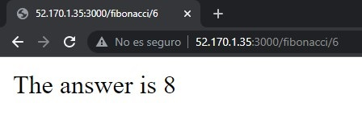
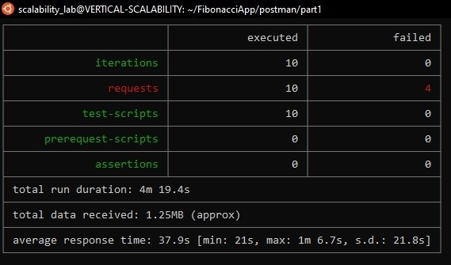
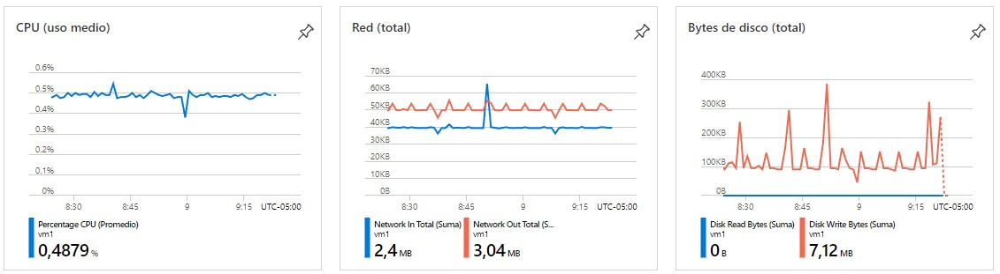

### Escuela Colombiana de Ingeniería
### Arquitecturas de Software - ARSW

### Estudiante
   + Brayan Andrés Macías Turmequé

## Escalamiento en Azure con Maquinas Virtuales, Sacale Sets y Service Plans

### Dependencias
   
   

### Parte 1 - Escalabilidad vertical

1. Creación de Máquina

   

3. Instale node

   

5. Para instalar la aplicación adjunta al Laboratorio, suba la carpeta `FibonacciApp` a un repositorio al cual tenga acceso y ejecute estos comandos dentro de la VM:

   

5. Para ejecutar la aplicación puede usar el comando `npm FibinacciApp.js`, sin embargo una vez pierda la conexión ssh la aplicación dejará de funcionar. Para evitar ese compartamiento usaremos *forever*. Ejecute los siguientes comando dentro de la VM.

   
   

6. Antes de verificar si el endpoint funciona, en Azure vaya a la sección de *Networking* y cree una *Inbound port rule* tal como se muestra en la imágen. Para verificar que la aplicación funciona, use un browser y user el endpoint `http://xxx.xxx.xxx.xxx:3000/fibonacci/6`. La respuesta debe ser `The answer is 8`.

   
   

7. La función que calcula en enésimo número de la secuencia de Fibonacci está muy mal construido y consume bastante CPU para obtener la respuesta. Usando la consola del Browser documente los tiempos de respuesta para dicho endpoint usando los siguintes valores:
    * 1000000
   
      
   
    * 1010000
   
      
   
    * 1020000
   
      
   
    * 1030000
   
      
   
    * 1040000
   
      
   
    * 1050000
   
      
   
    * 1060000
   
      
   
    * 1070000
   
      
   
    * 1080000
   
      
   
    * 1090000    
   
      
   

8. Dírijase ahora a Azure y verifique el consumo de CPU para la VM. (Los resultados pueden tardar 5 minutos en aparecer).

   

9. Ahora usaremos Postman para simular una carga concurrente a nuestro sistema. Siga estos pasos.
Archivo

   

   Ejecución

   
   

10. La cantidad de CPU consumida es bastante grande y un conjunto considerable de peticiones concurrentes pueden hacer fallar nuestro servicio. Para solucionarlo usaremos una estrategia de Escalamiento Vertical. En Azure diríjase a la sección *size* y a continuación seleccione el tamaño `B2ms`.

      

11. Una vez el cambio se vea reflejado, repita el paso 7, 8 y 9.
    * 1000000
      
      
      
    * 1010000
      
      
      
    * 1020000
      
      
      
    * 1030000
      
      
      
    * 1040000
      
      
      
    * 1050000
      
      
      
    * 1060000
      
      
      
    * 1070000
      
      
      
    * 1080000
      
      
      
    * 1090000
      
      

12. Evalue el escenario de calidad asociado al requerimiento no funcional de escalabilidad y concluya si usando este modelo de escalabilidad logramos cumplirlo.

   Teniendo en cuenta que realizando el escalamiento vertical no hubo una mejora significativa en el tiempo que duran las consultas ni tampoco hubo una mejora real respecto a las peticiones concurrentes, podemos decir que para nada estamos cumpliendo el escenario de calidad propuesto, ya que el uso de la CPU está casi al 100% durante todo el tiempo de jecución y la disponibilidad no mejora en lo absoluto.

13. Vuelva a dejar la VM en el tamaño inicial para evitar cobros adicionales.

**Preguntas**

1. ¿Cuántos y cuáles recursos crea Azure junto con la VM?

   

2. ¿Brevemente describa para qué sirve cada recurso?

   + Virtual Network: Azure Virtual Network (VNet) es el bloque de creación fundamental de una red privada en Azure. VNet permite muchos tipos de recursos de Azure, como Azure Virtual Machines (máquinas virtuales), para comunicarse de forma segura entre usuarios, con Internet y con las redes locales.
   + Storage account: Azure Storage es un servicio administrado por Microsoft que proporciona almacenamiento en la nube altamente disponible, seguro, duradero, escalable y redundante.
   + Virtual machine: es un software que simula un sistema de computación y puede ejecutar programas como si fuese una computadora real.
   + Public Ip address: Una dirección IP pública es una dirección IP dinámica o estática que puede asignar a máquinas virtuales, equilibradores de carga y puertas de enlace de red virtual para comunicarse con Internet. Sus direcciones IP públicas están asociadas con su suscripción de Azure y se pueden mover libremente entre los recursos de Azure.
   + Network security group: Un grupo de seguridad de red es una capa de seguridad que actúa como un firewall virtual para controlar el tráfico de entrada y salida de máquinas virtuales (a través de interfaces de red) y subredes. Contiene un conjunto de reglas de seguridad que permiten o niegan el tráfico entrante y saliente utilizando las siguientes 5 tuplas: protocolo, rango de dirección IP de origen, rango de puerto de origen, rango de dirección IP de destino y rango de puerto de destino.
   + Network interface: Las interfaces de red se utilizan para configurar direcciones IP, configuraciones de red virtual y servidores DNS que se asignarán a una máquina virtual. Microsoft Azure admite la conexión de múltiples interfaces de red (NIC) a una máquina virtual para una flexibilidad adicional en las opciones de conectividad de red.
   + Disk: Cada máquina virtual de Azure está conectada a al menos un disco para el sistema operativo y el almacenamiento persistente. Un disco puede ser una unidad estándar (HDD) premium (SSD). Los discos creados con este método solo se pueden usar con máquinas virtuales clásicas.

3. ¿Al cerrar la conexión ssh con la VM, por qué se cae la aplicación que ejecutamos con el comando npm FibonacciApp.js? ¿Por qué debemos crear un Inbound port rule antes de acceder al servicio?

   + Porque el proceso se ejecuta en la sesión.
   + Para poder decirle a la MV por dónde se va a solicitar la petición de recursos, de manera que debe atender solicutdes por ese puerto.

4. Adjunte tabla de tiempos e interprete por qué la función tarda tando tiempo.

   

   Como la ejecución es lineal y en profundidad, no es posible obtener un resultado sin haber calculado todos los anteriores.

5. Adjunte imágen del consumo de CPU de la VM e interprete por qué la función consume esa cantidad de CPU.

   

   El cálculo del iésimo elemento se incrementa con cada cálculo hecho previamente, ya que el número se hace cada vez mas grande, de manera que el proceso incrementa su uso.

6. Adjunte la imagen del resumen de la ejecución de Postman. Interprete:
   + Tiempos de ejecución de cada petición.
   
      
      
   
   + Si hubo fallos documentelos y explique.
   
      Sí existieron errores, esto debido a las grandes cantidades de iteraciones al intentar acceder al recurso en un mismo instante, lo que demuestra la poca eficiencia del programa y produce fallas. Se ve una leve mejoria en los tiempos con la mayor capacidad, pero los fallos persisten ya que se debe a un problema más de concurrencia.
   
7. ¿Cuál es la diferencia entre los tamaños B2ms y B1ls (no solo busque especificaciones de infraestructura)?

   A parte de que B2ms tiene más del doble de recursos en algunos apartados de hardware, está también, por ejemplo, que el parámetro "Max CPU Perf of VM" es del 200% para B2ms, mientras que para B1ls sigue siendo del 100%. Todo esto se traduce en mayor desempeño pero así mismo un mayor costo.

8. ¿Aumentar el tamaño de la VM es una buena solución en este escenario?, ¿Qué pasa con la FibonacciApp cuando cambiamos el tamaño de la VM?

   + No, ya que los tiempos de obtención para los resultados varian a lo mucho entre 4 y 6 segundos, lo cual no es significativvo cuando esto supera los 15 segundos de ejecución.

   + Cuando cambiamos el tamaño de la VM, el proceso tiene más recursos a disposición, de manera que puede "ampliarse" en su ejecución tanto en CPU como en memoria, o sea, no es necesario que espere que se estén liberando recursos dinámicamente todo el tiempo.

9. ¿Qué pasa con la infraestructura cuando cambia el tamaño de la VM? ¿Qué efectos negativos implica?

   Aumenta la capacidad y el procesamiento de la máquina pero para ello se tiene que reiniciar, lo cual interrumpe el servicio que se ejecuta y no es conveniente en terminos de disponibilidad.

10. ¿Hubo mejora en el consumo de CPU o en los tiempos de respuesta? Si/No ¿Por qué?
   
      Sí hubo mejoria pero muy leve, ya que el cambio ofrece un mayor tamaño, almacenamiento y RAM. Lo que implica que se puede ofrecer mayor potencia y mejoria en el procesamiento ante las cantidades de iteraciones que se realizan en el mismo tiempo.

11. Aumente la cantidad de ejecuciones paralelas del comando de postman a 4. ¿El comportamiento del sistema es porcentualmente mejor?
   
      El comportamiento porcentualmente es casi igual, no se ven muchas diferencias. Como el sitema no puede manejar de la mejor manera las ejecuciones concurrentes, esto no mejora el tiempo de respuesta ni el ecenario de rendimiento.

### Parte 2 - Escalabilidad horizontal

#### Probar el resultado final de nuestra infraestructura

1. Porsupuesto el endpoint de acceso a nuestro sistema será la IP pública del balanceador de carga, primero verifiquemos que los servicios básicos están funcionando:
   
   
   
   

2. Realice las pruebas de carga con `newman` que se realizaron en la parte 1 y haga un informe comparativo donde contraste: tiempos de respuesta, cantidad de peticiones respondidas con éxito, costos de las 2 infraestrucruras, es decir, la que desarrollamos con balanceo de carga horizontal y la que se hizo con una maquina virtual escalada.
   
   + Resultados
   
      
   
      

   + Consumo de Recursos
      
      VM1
      
      
      
      VM2
      
      
      
      VM2
      
      

   En contraste con el anterior resultado del escalamiento vertical, podemos destacar que uno de los mayores cambios fue el de la disponibilidad, de manera que no se está perdiendo el servicio durante la ejecución de las peticiones de manera seguida. Otro punto importante es que ahora las peticiones concurrentes están soportadas y son ralizadas sin que se pierda el servicio, todo esto gracias a que ahora es posibles distribuir la carga y ejecutar procesos concurrentes.
   Respecto a los costos y basánsonos en los precios manejados en Azure, podemos decir que el escalamiento horizontal es 100% calidad/precio, ya que costando 1/6 del escalamiento vertical, ofrece mayor disponibilidad soportando peticiones concurrentes.
   
   
3. Agregue una 4 maquina virtual y realice las pruebas de newman, pero esta vez no lance 2 peticiones en paralelo, sino que incrementelo a 4. Haga un informe donde presente el comportamiento de la CPU de las 4 VM y explique porque la tasa de éxito de las peticiones aumento con este estilo de escalabilidad.

   + Resultados
   
      
   
      
   
      
   
      

   + Consumo de Recursos
      
      VM1
      
      
      
      VM2
      
      
      
      VM3
      
      
      
      VM4
      
      

**Preguntas**

* ¿Cuáles son los tipos de balanceadores de carga en Azure y en qué se diferencian?, ¿Qué es SKU, qué tipos hay y en qué se diferencian?, ¿Por qué el balanceador de carga necesita una IP pública?
   
   + **Simplify load balancing for applications:** Con el equilibrio de carga incorporado para servicios en la nube y máquinas virtuales, puede crear aplicaciones altamente disponibles y escalables en minutos. Azure Load Balancer admite protocolos basados ​​en TCP / UDP como HTTP, HTTPS y SMTP, y protocolos utilizados para aplicaciones de mensajería de voz y video en tiempo real.
   
   + **Internal load balancer:** Use el equilibrador de carga interno para el tráfico entre máquinas virtuales dentro de sus redes virtuales privadas, o úselo para crear aplicaciones híbridas de varios niveles.
   
* ¿Cuál es el propósito del *Backend Pool*?
   
   Se refiere al conjunto de backends que reciben tráfico similar para su aplicación. En otras palabras, es una agrupación lógica de sus instancias de aplicaciones en todo el mundo que reciben el mismo tráfico y responden con el comportamiento esperado.
   
* ¿Cuál es el propósito del *Health Probe*?
   
   + **Health Probe:** se usan para determinar el estado de mantenimiento de las instancias del grupo de back-end. Durante la creación del equilibrador de carga, configure un sondeo de estado para que lo use el equilibrador de carga. Este sondeo de estado determinará si una instancia está en buen estado y puede recibir tráfico.
   
* ¿Cuál es el propósito de la *Load Balancing Rule*? ¿Qué tipos de sesión persistente existen, por qué esto es importante y cómo puede afectar la escalabilidad del sistema?.
   
   + **Load Balancing Rule:** se usan para definir cómo se distribuye el tráfico entrante a todas las instancias del grupo de back-end. Las reglas de equilibrio de carga asignan una configuración de dirección IP de front-end y un puerto dados a varios puertos y direcciones IP de back-end.

   + **None (hash-based):** Especifica que las solicitudes sucesivas del mismo cliente pueden ser manejadas por cualquier máquina virtual.

   + **Client IP (source IP affinity 2-tuple):** Especifica que las peticiones sucesivas de la misma dirección IP del cliente serán gestionadas por la misma máquina virtual.

   + **Client IP and Protocol (Source IP affinity 3-tuple):** Especifica que las solicitudes sucesivas de la misma combinación de dirección IP de cliente y protocolo serán tratadas por la misma máquina virtual.
   
* ¿Qué es una *Virtual Network*? ¿Qué es una *Subnet*? ¿Para qué sirven los *address space* y *address range*?
   
   + **Virtual Network:** Sirve para comunicarse de forma segura entre usuarios, con Internet y con las redes locales.
   + **Subnet:** le permiten segmentar la red virtual en una o más subredes y asignar una parte del espacio de direcciones de la red virtual a cada subred. Luego puede implementar recursos de Azure en una subred específica.
   + **address space:** al crear una red virtual, debe especificar un espacio de direcciones IP privadas personalizadas utilizando direcciones públicas y privadas (RFC 1918). Azure asigna recursos en una red virtual a una dirección IP privada desde el espacio de direcciones que asigne.
   + **address range:** El rango de direcciones que defina puede ser público o privado (RFC 1918). Ya sea que defina el rango de direcciones como público o privado, solo se puede acceder al rango de direcciones desde la red virtual, desde redes virtuales interconectadas y desde cualquier red local que haya conectado a la red virtual.
   
* ¿Qué son las *Availability Zone* y por qué seleccionamos 3 diferentes zonas?. ¿Qué significa que una IP sea *zone-redundant*?
   
   + **Availability Zone:** Una zona de disponibilidad es una zona separada físicamente dentro de una región de Azure. Hay tres zonas de disponibilidad por cada región de Azure admitida.

   + **Zonas:** Cada zona de disponibilidad tiene una fuente de alimentación, una red y un sistema de refrigeración distintos. Si diseña las soluciones para que utilicen máquinas virtuales replicadas en zonas, podrá proteger sus datos y aplicaciones frente a la pérdida de un centro de datos.
   
      Elejimos 3 diferentes zonas por cuestiones de disponibilidad mayormente.

   + **zone-redundant:** Es una dirección IP-Pública que si se produce un error en una región, el tráfico se enruta al siguiente equilibrador de carga regional correcto más cercano.
   
* ¿Cuál es el propósito del *Network Security Group*?
   
   + **Network Security Group:** es una capa de seguridad que actúa como un firewall virtual para controlar el tráfico de entrada y salida de máquinas virtuales (a través de interfaces de red) y subredes. Contiene un conjunto de reglas de seguridad que permiten o niegan el tráfico entrante y saliente utilizando las siguientes 5 tuplas: protocolo, rango de dirección IP de origen, rango de puerto de origen, rango de dirección IP de destino y rango de puerto de destino.
   
* Informe de newman 1 (Punto 2)
   
   **Ya realizado antes de las preguntas**
   
* Presente el Diagrama de Despliegue de la solución.
   
   
